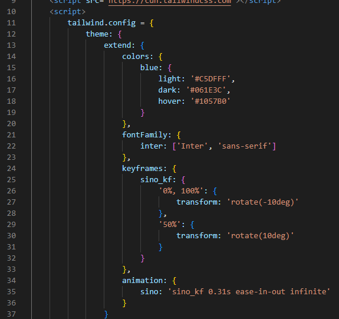

<h1>Alura Newsletter | Tailwind CSS: estilizando a sua página com classes utilitárias</h1>

Repositório com a newsletter da Alura. O projeto original é do curso Tailwind CSS: estilizando a sua página com classes utilitárias da Alura Escola Online de Tecnologia.

<h2>:file_folder: Detalhes do projeto</h2> 

Com a finalidade de estudo a instalação do Tailwind foi feita através do Play CDN.

  

 

Para este projeto foram criadas personalizações de cores, fontes e animações.

  

 

A abordagem usada nesta aplicação foi a mobile-first. E para garantir a responsividade do projeto foram usados os  breakpoints padrões do Tailwind.

Para animação do sino de notificação, também foi feita uma customização no tailwind-config.

  

 

<h2>:computer: Tecnologias utilizadas</h2>

    
    

